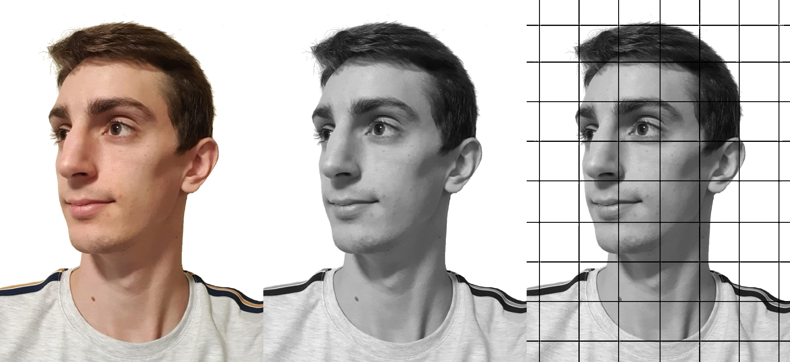
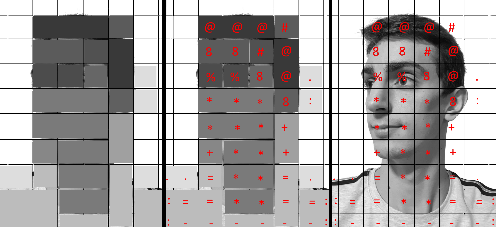
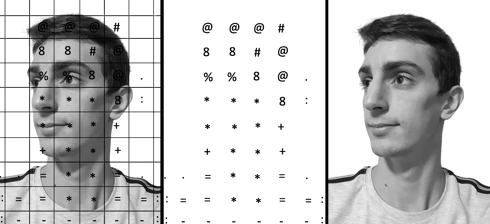

# ASCII Images

A small tool to transform images to ASCII files.

5 stages:
1) transform image to black and white
2) split image into large pixels
3) calculate the average gray scale for each large pixel
4) assign an ASCII character to this gray scale (darker character to darker gray scale)
5) output the ASCII string representing the image

Of course, using a more precise grid gives much better results.
